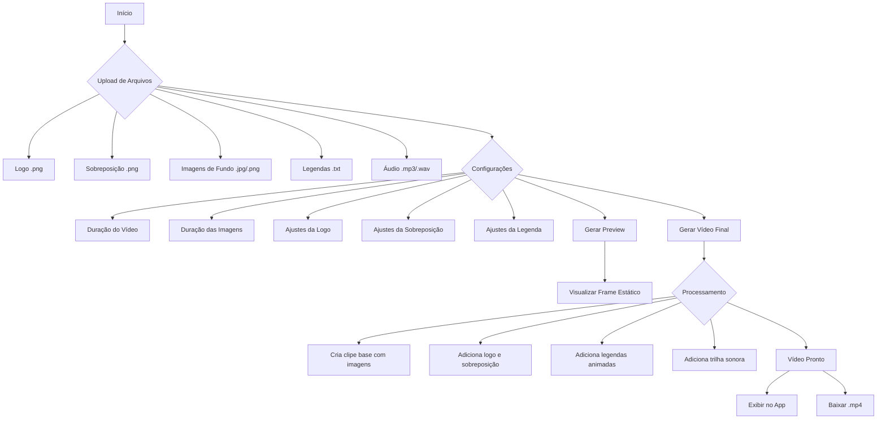

# Editor de Vídeo para Reels do Instagram

## 📖 Descrição

Esta é uma aplicação web desenvolvida com Streamlit que permite a criação rápida e personalizada de vídeos no formato de Reels para o Instagram (9:16). A ferramenta oferece uma interface intuitiva para combinar imagens, adicionar logos, sobreposições, legendas dinâmicas e trilha sonora, automatizando o processo de edição de vídeo.

## 🌊 Fluxo de Uso

O diagrama abaixo ilustra o fluxo de trabalho da aplicação, desde o upload dos arquivos até a geração do vídeo final.



## ✨ Funcionalidades

-   **Upload de Múltiplos Arquivos:**
    -   Logo da marca (PNG).
    -   Imagem de sobreposição (PNG).
    -   Múltiplas imagens de fundo (JPG/PNG) para compor o vídeo.
    -   Arquivo de texto (`.txt`) para as legendas.
    -   Trilha sonora (MP3/WAV).
-   **Configurações Gerais do Vídeo:**
    -   Definição da duração total do vídeo (15 a 90 segundos).
    -   Ajuste da duração de exibição de cada imagem.
-   **Personalização de Elementos:**
    -   **Logo:** Controle de posição (X, Y), tamanho e transparência.
    -   **Sobreposição:** Controle de posição (X, Y), tamanho e transparência.
    -   **Legendas:**
        -   Efeito de letreiro (scrolling text).
        -   Opção de loop para a animação da legenda.
        -   Controle de posição (Y), velocidade, tamanho da fonte, cor e tipo da fonte.
-   **Preview Rápido:**
    -   Gere uma pré-visualização estática (um frame) da composição dos elementos visuais antes de renderizar o vídeo completo.
-   **Geração e Download:**
    -   Renderização do vídeo final em formato `.mp4`.
    -   Incorporação da trilha sonora, ajustada à duração do vídeo.
    -   Opção para baixar o vídeo diretamente pela interface.

## 🛠️ Tecnologias Utilizadas

-   **Python 3:** Linguagem de programação principal.
-   **Streamlit:** Framework para a criação da interface web.
-   **MoviePy:** Biblioteca para edição de vídeo.
-   **Pillow (PIL):** Para manipulação de imagens.
-   **NumPy:** Para operações numéricas, utilizada pelo MoviePy e Pillow.

## 🚀 Como Executar o Projeto

Siga os passos abaixo para configurar e executar a aplicação em seu ambiente local.

### 1. Pré-requisitos

-   Python 3.8 ou superior instalado.
-   `pip` (gerenciador de pacotes do Python).

### 2. Configuração do Ambiente

**Clone o repositório (se aplicável):**
```bash
git clone <URL_DO_REPOSITORIO>
cd <NOME_DA_PASTA>
```

**Crie e ative o ambiente virtual:**
```bash
# Crie o ambiente virtual
python -m venv .venv

# Ative o ambiente (Linux/macOS)
source .venv/bin/activate

# Ative o ambiente (Windows)
.venv\Scripts\activate
```

### 3. Instalação das Dependências

Com o ambiente virtual ativado, instale as bibliotecas necessárias:
```bash
pip install -r requirements.txt
```

### 4. Executando a Aplicação

Para iniciar o editor de vídeo, execute o seguinte comando no seu terminal:
```bash
streamlit run video_editor.py
```

A aplicação será aberta automaticamente no seu navegador padrão.